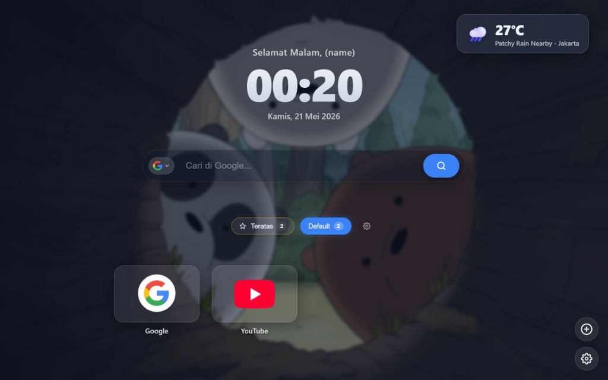

# 🌟 Elyxora Tab - Personal New Tab Dashboard

[](#)
[](#)
[](#)

<p align="center">
  
</p>

Halo teman-teman! 👋 Selamat datang di **Elyxora Tab** (atau *Elyxora Tap*). 

Pernah merasa bosan dengan tampilan halaman tab baru Google Chrome yang gitu-gitu aja? Nah, ekstensi ini dibuat khusus untuk mengubah tab baru kamu menjadi sebuah dashboard personal yang **super estetik, minimalis, dan fungsional**. Dengan perpaduan gaya *glassmorphism* (efek kaca transparan) dan *neumorphism* modern, dijamin mata kamu bakal dimanjakan setiap kali membuka tab baru!

---

## ✨ Fitur-Fitur Keren (Apa aja sih fiturnya?)

Berikut beberapa fitur seru yang bisa kamu nikmati dan kustomisasi sesuka hati:

### 1. 🗂️ Kelompokkan Link Favoritmu (Tabbed Shortcuts)
*   Biar gak berantakan, kamu bisa membagi pintasan situs web (*bookmark*) favorit ke dalam berbagai kategori grup (misalnya: "Kerjaan", "Sosmed", "Hiburan", "Kuliah").
*   Tinggal klik, kamu bisa tambah, edit, atau hapus pintasan secara langsung.
*   Bisa pasang ikon kustom menggunakan URL gambar dari internet maupun mengunggah file gambar langsung dari komputermu.

### 2. 🔍 Cari Apa Saja, Bebas Pilih Engine! (Multi-Search Engine)
*   Bisa ganti-ganti mesin pencari (Google, Bing, Yahoo, dan DuckDuckGo) dengan sekali klik pada ikon di sebelah kiri kolom pencarian.
*   Dilengkapi fitur **Search Suggestions** (saran kata kunci) otomatis saat kamu mulai mengetik biar pencarian makin cepat dan *sat-set*!

### 3. 🕒 Jam Dinamis dengan Berbagai Gaya Keren
Bosan dengan tampilan jam digital yang standar? Sesuaikan gaya jamnya dengan kepribadian kamu:
*   *Swiss & Bold* (Bergaya minimalis eropa)
*   *Glassmorphism* (Efek kaca blur transparan yang elegan)
*   *Cyberpunk* (Glow neon yang futuristik)
*   *Retro Digital* (Jam klasik 7-segment)
*   *Gradient Rainbow* (Warna gradasi pelangi yang hidup)
*   *Flip Clock* (Gaya jam mekanis klasik)
*   *Border Tracer* (Animasi garis berjalan mengelilingi jam)
*   *Ukuran Jam*: Bisa diperbesar atau diperkecil sesuka hati (dari 50% hingga 200%).

### 4. ⛅ Widget Cuaca Real-Time
*   Pantau suhu dan kondisi cuaca di lokasi kamu saat ini secara langsung di pojok kanan atas.
*   Bisa menampilkan prakiraan cuaca jangka pendek (*weather forecast*).
*   Mendukung pencarian kota tertentu dan konversi unit suhu antara Celsius (°C) dan Fahrenheit (°F).

### 5. 🎨 Wallpaper Engine & Pengatur Efek Latar Belakang
*   Bisa pakai wallpaper default yang disediakan, menempelkan link gambar eksternal, atau **unggah foto kamu sendiri**.
*   Ada slider untuk mengatur tingkat **Blur** dan **Kecerahan (Brightness/Opacity)** gambar latar belakang secara *real-time* agar tulisan di tab baru kamu tetap terbaca dengan jelas.

### 6. 👋 Sapaan Personal yang Ramah
*   Kamu bisa memasukkan nama panggilanmu di panel pengaturan.
*   Setiap kali kamu membuka tab baru, dashboard akan menyapamu secara hangat (contoh: *"Selamat Pagi, Kak Rizkan"* atau *"Selamat Malam, Kak"*).

---

## 🛠️ Cara Pasang di Browser Kamu (Gampang Banget!)

Karena ekstensi ini masih dalam tahap pengembangan mandiri (belum dipublikasikan ke Chrome Web Store), kamu bisa memasangnya secara manual dengan cara berikut:

1.  **Download / Clone** repositori ini ke dalam komputermu.
2.  Buka browser **Google Chrome**, lalu masuk ke halaman ekstensi dengan mengetik alamat berikut pada URL bar:
    ```txt
    chrome://extensions/
    ```
3.  Aktifkan opsi **Mode pengembang (Developer mode)** di pojok kanan atas layar.
4.  Klik tombol **Muat ekstensi tidak dikemas (Load unpacked)** di pojok kiri atas.
5.  Pilih folder proyek **Elyxora Tap** (pilih folder induk yang langsung berisi file `manifest.json`).
6.  Selesai! Sekarang coba buka tab baru di Chrome kamu. Selamat menikmati dashboard barumu! 🎉

---

## 📁 Struktur Berkas Proyek

Bagi kamu yang penasaran dengan isi di balik layar, berikut struktur berkasnya:

```bash
Elyxora Tap/
├── manifest.json       # Otak ekstensi (konfigurasi Manifest V3 untuk Chrome)
├── newtab.html         # Struktur layout utama dashboard tab baru
├── style.css           # Bumbu rahasia kecantikan visual & efek glassmorphism
├── newtab.js           # Pengatur jam, cuaca, pencarian, dan sapaan personal
├── settings.js         # Pengelola panel kustomisasi/setelan dashboard
├── groups.js           # Logika pembuatan grup tab & kelola link bookmark
├── modal.js            # Pengatur animasi pop-up (dialog box) saat tambah link
├── preview.png         # Gambar screenshot tampilan dashboard kamu
└── icons/              # Berbagai ukuran ikon resmi Elyxora Tab (16px, 48px, 128px)
```

---

*Dibuat untuk produktivitas yang lebih baik dan indah 😉.*

